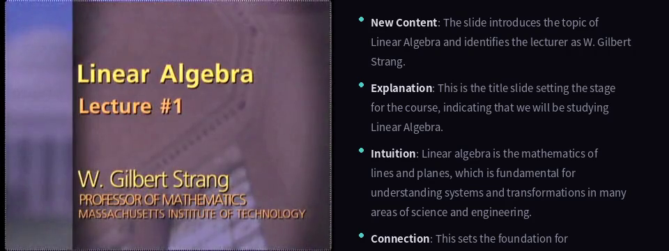
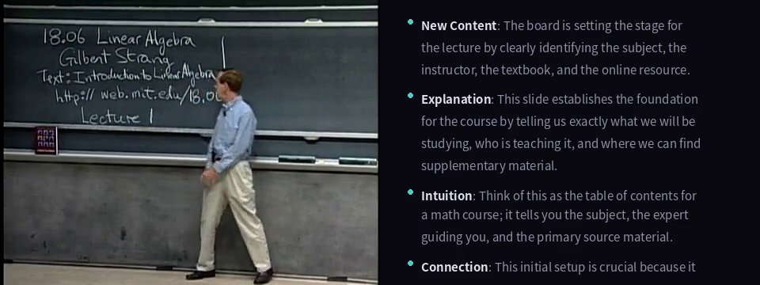

# slideGemma

Lecture video analysis, real-time desktop study assistant, and multimodal fine-tuning — powered by **Google Gemma 4**.

---

> ## EE6405 Project
>
> This project was developed as part of **EE6405 Natural Language Processing** Project.
>
> **Team:** A1

---

## Features

- **Video Analysis** — segment lecture videos, generate per-slide teaching explanations, output annotated videos and Markdown reports
- **Desktop Study** — capture any window live, analyze via llama.cpp, show results in a floating overlay
- **QLoRA Fine-Tuning** — fine-tune Gemma 4 E2B-IT on SlideVQA / M3AV / LPM datasets

## Demo

Input: MIT 18.06 Linear Algebra Lecture 1 (Gilbert Strang), first 60 s.


| Input                    | Output                      |
| ------------------------ | --------------------------- |
| `demo/input_lecture.mp4` | `demo/output_annotated.mp4` |


**Output screenshots:**

| Slide detection | Whiteboard detection |
|:---:|:---:|
|  |  |

The annotated video panel shows four teaching dimensions per segment:

- **New Content** — what appeared in this frame
- **Explanation** — step-by-step teaching
- **Intuition** — analogies and deeper understanding
- **Connection** — links to previous and upcoming content

Full report: `demo/output_report.md`

## Quick Start

```bash
# Install Python dependencies
pip install -r requirements.txt

# System font (for annotated-video panel rendering)
sudo apt-get install -y fonts-noto-cjk
```

**Analyse a video:**

```bash
python tools/analyze.py lecture.mp4 --realtime
python tools/analyze.py lecture.mp4 --mode whiteboard --audio
```

**Desktop study mode (GUI, Windows):**

```bash
pip install PySide6 matplotlib windows-capture
python tools/gui.py
```

**Fine-tune with QLoRA:**

```bash
python tools/finetune.py --dataset slidevqa
python tools/finetune.py --config configs/qlora_slidevqa.yaml
```

## Project Structure

```
slide_gemma/
├── models/          # Model loading: HF Transformers + llama.cpp + QLoRA
├── analysis/        # Video classification, prompts, desktop analysis
├── media/           # Frame extraction (PyAV), segmentation, audio (Whisper)
├── output/          # Markdown reports, annotated video rendering
├── data/            # Dataset loaders: SlideVQA, M3AV, LPM
├── training/        # QLoRA trainer (PEFT + TRL)
└── gui/             # PySide6 desktop app with floating overlay
tools/
├── analyze.py       # Video analysis CLI
├── finetune.py      # Fine-tuning CLI
└── gui.py           # Desktop GUI launcher
configs/             # YAML training configs
demo/                # Sample input/output (video, report, screenshots)
```

## Video Types


| Type                 | Detection                                      | Focus                          |
| -------------------- | ---------------------------------------------- | ------------------------------ |
| **Slides**           | Pixel-diff threshold 0.15                      | Slide content teaching         |
| **Teacher + Slides** | Threshold 0.12                                 | Slide + teacher narration      |
| **Whiteboard**       | Low threshold 0.03, compare consecutive frames | Identify newly written content |
| **Teacher Only**     | Timed sampling 30 s                            | Relies on audio transcription  |
| **Screen Recording** | Threshold 0.10                                 | Software-operation teaching    |


## Requirements

- Python >= 3.10
- NVIDIA GPU >= 8 GB VRAM (E2B) or >= 16 GB (E4B)
- CUDA >= 12.1
- FFmpeg (audio extraction + video compositing)
- `fonts-noto-cjk` (annotated-video panel)

## License

Apache 2.0